  

  
  
  

I build data systems that put information in the hands of the people who decide. At Bioz Green I design, build and run the company's software, from the database to the deploy: ETL from the ERP, APIs, Docker microservices, AI agents and security. Before that I spent years in warehouses, inventory and logistics, turning spreadsheets into macros, macros into scripts and scripts into systems.

  

  
  

## Featured projects

<table>
<tr>
<td width="50%" valign="top">

 <b>Financial BI Dashboard</b>: ERP to PostgreSQL ETL, SQL analytics with RLS. <b>~60%</b> faster monthly close in production.
</td>
<td width="50%" valign="top">

 <b>Route Planning + Delivery Tracking</b>: VRP with time windows and an offline-first driver app. <b>3 h → 2 min</b>.
</td>
</tr>
<tr>
<td width="50%" valign="top">

 <b>Luminus</b>: WhatsApp AI assistant with a queue, a model pool that falls back on quota errors, and Postgres memory.
</td>
<td width="50%" valign="top">

 <b>Jarvis CV</b>: SaaS with deterministic ATS scoring, a 5-model AI layer and Stripe subscriptions.
</td>
</tr>
<tr>
<td width="50%" valign="top">

 <b>E-commerce Data Pipeline</b> (day 01): raw files to a PostgreSQL star schema, reconciled to the cent. COPY <b>2.7x</b> faster than INSERT.
</td>
<td width="50%" valign="top">

 <b>Data Quality Engine</b> (day 02): YAML rules and a CI gate. Finds <b>6 of 6</b> injected problem types with the exact count.
</td>
</tr>
<tr>
<td width="50%" valign="top">

 <b>Video Transcriber</b>: API and worker split, Postgres as a queue. <a href="https://video-transcriber-gilt.vercel.app">Live demo</a>.
</td>
<td width="50%" valign="top">

 <b>WhatsApp AI Agent</b>: n8n + WAHA + LLM with Redis memory, the no-code sibling of Luminus.
</td>
</tr>
</table>

More in [30 Days of Data & Software Engineering](https://github.com/silvano-moraes-de-souza/30-days-data-eng), one working system per day, every number from a committed benchmark.

## Stack

  

  <picture>
    <source media="(prefers-color-scheme: dark)" srcset="https://raw.githubusercontent.com/silvano-moraes-de-souza/silvano-moraes-de-souza/output/snake-dark.svg">
    
  </picture>

The language and progress cards are rebuilt every day by <a href=".github/workflows/stats.yml">a GitHub Action</a> from live repository data; the contribution animation too.
